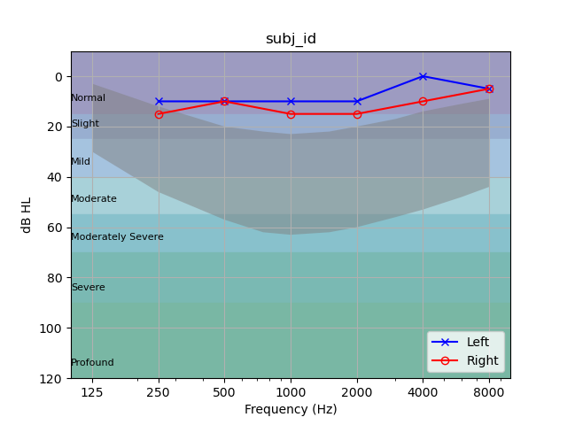

# audiometry
Python scripts for plotting audiograms and related data from [Interacoustics Equinox 2.0 audiometer](https://www.interacoustics.com/us/audiometry/clinical/equinox) and [Otoaccess software](https://www.interacoustics.com/us/otoaccess). Maybe similar scripts exist, but I haven't found them and wrote one myself. 

To run, this assumes you have a directory with .xml files that were exported from the Otoaccess software. 
Ours are named `[subj_id]_[date]_audiometry.xml`. If you name them this way, the function `main()` will show the subject ID as the title of each subplot.

The function `parse_audiometry()` takes in an xml file and outputs a dictionary `audiogram` that is organized by ear ('Left' and 'Right'). Each side contains another dictionary with the frequency of pure tones played and the measured thresholds in dB HL. For example:

``` 
>>> from audiometry import parse_audiometry
>>> audiogram = parse_audiometry('/path/to/subjid_20211101_audiometry.xml')
>>> print(audiogram)
{'Left': {250: 15, 500: 20, 1000: 10, 2000: 5, 4000: 5, 8000: 5},
 'Right': {250: 15, 500: 15, 1000: 10, 2000: 10, 4000: 10, 8000: 0}}
```

To plot this, you can use the function `plot_audiogram()`:

```
>>> from audiometry import plot_audiogram, parse_audiometry
>>> from matplotlib import pyplot as plt
>>> plt.ion()
>>> audiogram = parse_audiometry('/path/to/subjid_20211101_audiometry.xml')
>>> fig = plt.figure(1)
>>> plot_audiogram(audiogram, fig=fig, banana='Both', classification=True)
>>> plt.title('subj_id')
>>> plt.savefig('Example_audiogram.png')
>>> plt.show()
```



## Quick Start ##

You can also just do this to get audiograms for all files in a directory. Might look ugly, YMMV. Assumes you have all your `*.xml` files in a directory called `/path/to/audiograms`.

```
>>> import audiometry
>>> from matplotlib import pyplot as plt
>>> plt.ion()
>>> audiometry.main('/path/to/audiograms')
```

## In progress ##

Getting out QuickSIN data in addition to pure tone data is in progress but not yet implemented. 

Email Liberty Hamilton (liberty.hamilton@austin.utexas.edu) with any questions. 
